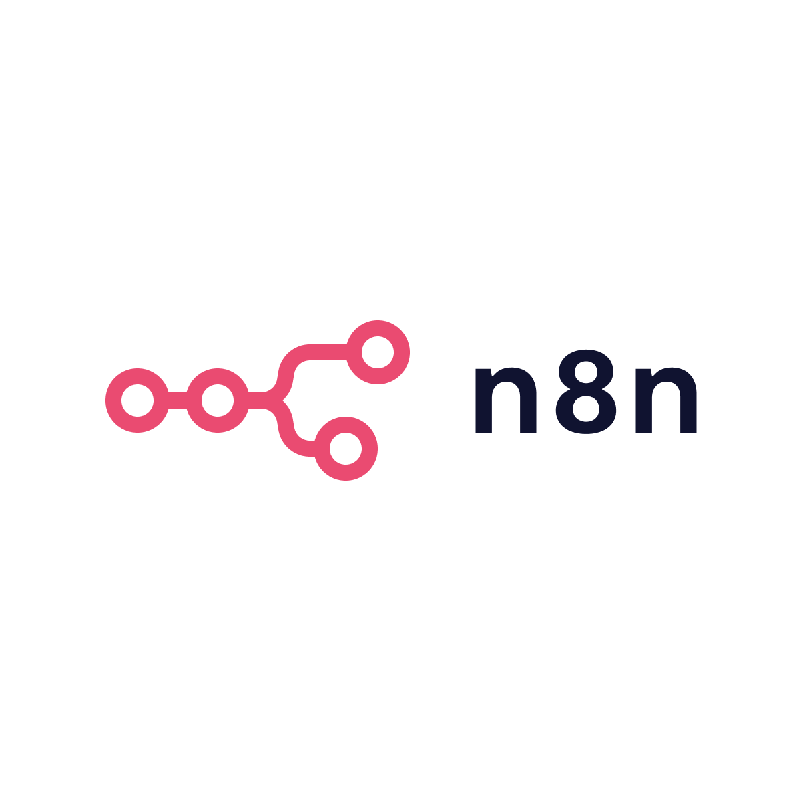
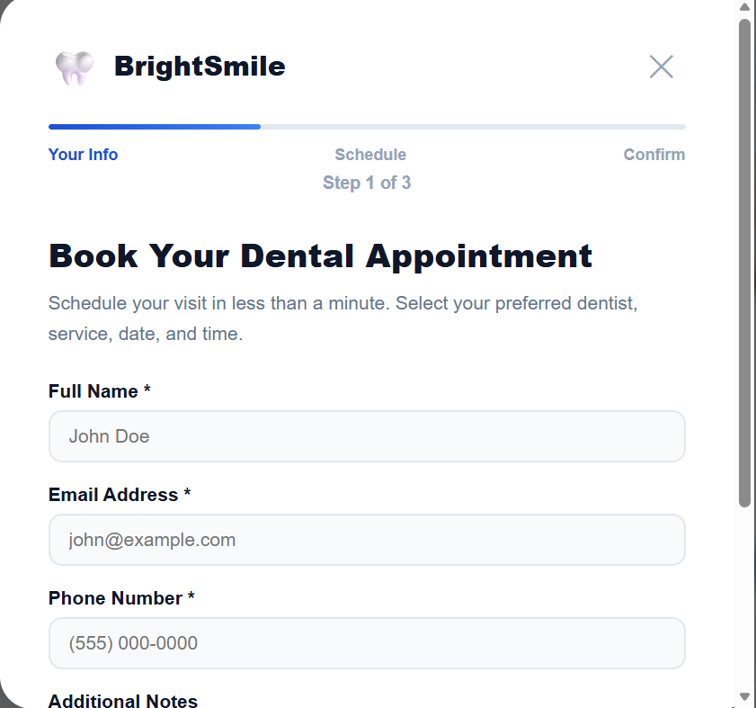
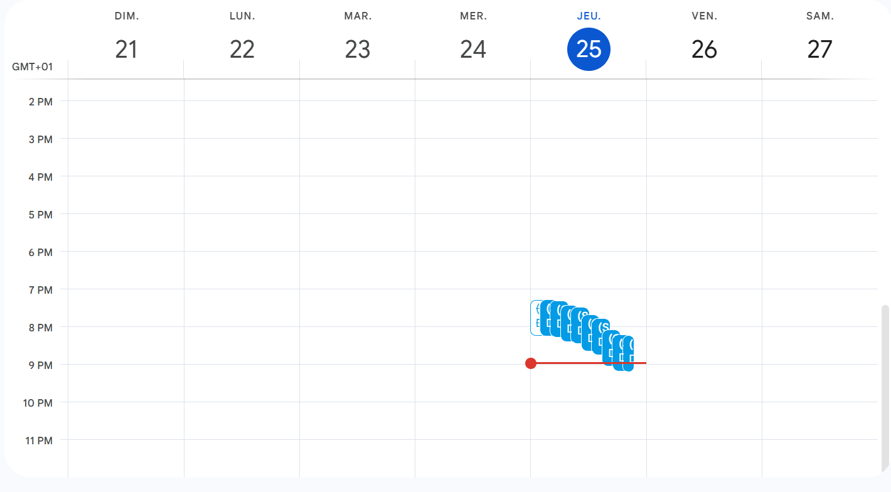
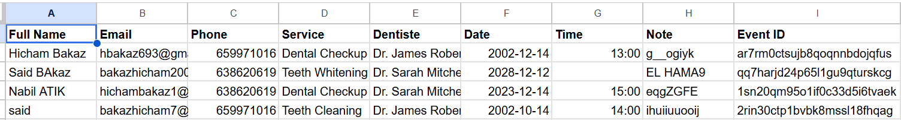
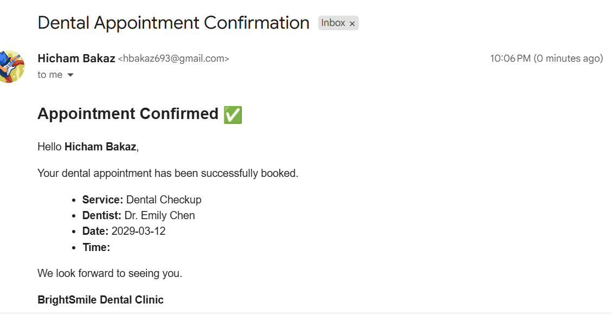
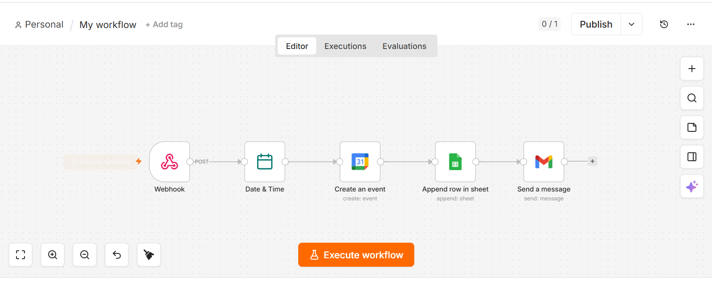

<!-- 
  ============================================================
  README.md - AI Dental Appointment System
  Version: 1.0.0
  Auteur: hbakaz693
  Licence: Propriétaire - Tous droits réservés
  ============================================================
-->

<h1 align="center">
  🦷 AI Dental Appointment System
</h1>

  <strong>Un système intelligent de prise de rendez-vous dentaire</strong> 
  React · n8n · Google Calendar · Google Sheets · Gmail

  
  
  
  
  

  
  

<h2>📋 Table des matières</h2>

  
<b>📌 Cliquer pour afficher</b>

1. [Aperçu du projet](#aperçu-du-projet)
2. [Fonctionnalités](#fonctionnalités)
3. [Architecture système](#architecture-système)
4. [Flux de travail](#flux-de-travail)
5. [Technologies utilisées](#technologies-utilisées)
6. [Captures d'écran](#captures-décran)
7. [Démo vidéo](#démo-vidéo)
8. [Workflow n8n](#workflow-n8n)
9. [Installation](#installation)
10. [Variables d'environnement](#variables-denvironnement)
11. [Structure du projet](#structure-du-projet)
12. [API et endpoints](#api-et-endpoints)
13. [Sécurité](#sécurité)
14. [Contribuer](#contribuer)
15. [Licence](#licence)
16. [Contact](#contact)

<h2 id="aperçu-du-projet">🔍 Aperçu du projet</h2>

  <strong>AI Dental Appointment System</strong> est une application web moderne qui permet aux patients
  de prendre des rendez-vous dentaires en ligne via une interface React simple et responsive.

  Le projet utilise l'automatisation <strong>n8n</strong> pour recevoir les données de rendez-vous,
  formater la date et l'heure, créer des événements dans <strong>Google Calendar</strong>,
  stocker les détails dans <strong>Google Sheets</strong>, et envoyer des emails de confirmation
  automatiques via <strong>Gmail</strong>.

<h3>🎯 Objectifs</h3>

<ul>
  <li>✅ Simplifier la prise de rendez-vous pour les patients</li>
  <li>✅ Automatiser entièrement le processus de réservation</li>
  <li>✅ Centraliser les données dans Google Sheets</li>
  <li>✅ Envoyer des confirmations instantanées par email</li>
  <li>✅ Offrir une expérience utilisateur fluide et moderne</li>
</ul>

<h2 id="fonctionnalités">✨ Fonctionnalités</h2>

<table>
  <tr>
    <td align="center">🖥️</td>
    <td><strong>Landing page moderne</strong> - Design professionnel pour le cabinet dentaire</td>
  </tr>
  <tr>
    <td align="center">📋</td>
    <td><strong>Formulaire multi-étapes</strong> - Réservation en quelques clics</td>
  </tr>
  <tr>
    <td align="center">🔌</td>
    <td><strong>Intégration n8n</strong> - Webhook pour l'automatisation</td>
  </tr>
  <tr>
    <td align="center">⏰</td>
    <td><strong>Formatage automatique</strong> - Date et heure optimisées</td>
  </tr>
  <tr>
    <td align="center">📅</td>
    <td><strong>Google Calendar</strong> - Création automatique des événements</td>
  </tr>
  <tr>
    <td align="center">📊</td>
    <td><strong>Google Sheets</strong> - Stockage sécurisé des réservations</td>
  </tr>
  <tr>
    <td align="center">📧</td>
    <td><strong>Gmail</strong> - Envoi automatique des confirmations</td>
  </tr>
  <tr>
    <td align="center">📱</td>
    <td><strong>Responsive</strong> - Compatible tous les appareils</td>
  </tr>
  <tr>
    <td align="center">🔒</td>
    <td><strong>Sécurisé</strong> - Protection des données patients</td>
  </tr>
</table>

<h2 id="architecture-système">🏗️ Architecture système</h2>

  <pre>
┌─────────────────────────────────────────────────────────────┐
│                      React Application                      │
│                   (Interface Utilisateur)                   │
└─────────────────────────┬───────────────────────────────────┘
                          │
                          ▼
┌─────────────────────────────────────────────────────────────┐
│                      n8n Webhook                           │
│                   (Réception des données)                   │
└─────────────────────────┬───────────────────────────────────┘
                          │
                          ▼
┌─────────────────────────────────────────────────────────────┐
│                  Date & Time Formatter                      │
│              (Formatage automatique)                        │
└─────────────────────────┬───────────────────────────────────┘
                          │
          ┌───────────────┼───────────────┐
          ▼               ▼               ▼
┌─────────────────┐ ┌─────────────────┐ ┌─────────────────┐
│ Google Calendar │ │  Google Sheets  │ │     Gmail       │
│   Événements    │ │    Données      │ │   Emails        │
└─────────────────┘ └─────────────────┘ └─────────────────┘
  </pre>

<h2 id="flux-de-travail">🔄 Flux de travail</h2>

<ol>
  <li><strong>👤 Patient</strong> - Remplit le formulaire de réservation</li>
  <li><strong>⚛️ React</strong> - Envoie les données au webhook n8n</li>
  <li><strong>🔌 n8n</strong> - Reçoit et traite les données</li>
  <li><strong>⏰ Formatage</strong> - Formate la date et l'heure</li>
  <li><strong>📅 Google Calendar</strong> - Crée l'événement</li>
  <li><strong>📊 Google Sheets</strong> - Stocke les informations</li>
  <li><strong>📧 Gmail</strong> - Envoie l'email de confirmation</li>
</ol>

<h2 id="technologies-utilisées">💻 Technologies utilisées</h2>

  <table>
    <tr>
      <td align="center">
         
        <strong>React</strong>
      </td>
      <td align="center">
         
        <strong>Vite</strong>
      </td>
      <td align="center">
         
        <strong>JavaScript</strong>
      </td>
      <td align="center">
         
        <strong>CSS3</strong>
      </td>
      <td align="center">
         
        <strong>GitHub</strong>
      </td>
    </tr>
    <tr>
      <td align="center">
         
        <strong>Google Calendar</strong>
      </td>
      <td align="center">
         
        <strong>Google Sheets</strong>
      </td>
      <td align="center">
         
        <strong>Gmail</strong>
      </td>
      <td align="center">
         
        <strong>n8n</strong>
      </td>
      <td align="center">
         
        <strong>Git</strong>
      </td>
    </tr>
  </table>

<h2 id="captures-décran">📸 Captures d'écran</h2>

<h3>🏠 Page d'accueil</h3>

  

<h3>📅 Formulaire de réservation</h3>

  

<h3>📆 Intégration Google Calendar</h3>

  

<h3>📊 Stockage Google Sheets</h3>

  

<h3>📧 Email de confirmation</h3>

  

<h2 id="démo-vidéo">🎥 Démo vidéo</h2>

  
   
  <em>▶️ Cliquez sur l'image pour voir la démonstration complète</em>

<h2 id="workflow-n8n">⚙️ Workflow n8n</h2>

  

<h3>Étapes du workflow</h3>

<table>
  <tr>
    <th>Étape</th>
    <th>Description</th>
  </tr>
  <tr>
    <td>1. Webhook</td>
    <td>Réception des données du formulaire React</td>
  </tr>
  <tr>
    <td>2. Date & Time</td>
    <td>Formatage automatique de la date et de l'heure</td>
  </tr>
  <tr>
    <td>3. Google Calendar</td>
    <td>Création de l'événement dans le calendrier</td>
  </tr>
  <tr>
    <td>4. Google Sheets</td>
    <td>Enregistrement des données patient</td>
  </tr>
  <tr>
    <td>5. Gmail</td>
    <td>Envoi de l'email de confirmation</td>
  </tr>
</table>

<h2 id="installation">🚀 Installation</h2>

<h3>Prérequis</h3>

<ul>
  <li>Node.js (version 16 ou supérieure)</li>
  <li>npm ou yarn</li>
  <li>Compte Google (Calendar, Sheets, Gmail)</li>
  <li>n8n installé (local ou cloud)</li>
</ul>

<h3>Étapes d'installation</h3>

<pre><code># 1. Cloner le dépôt
git clone https://github.com/hbakaz693/AI-Dental-Appointment-System.git

# 2. Accéder au dossier
cd AI-Dental-Appointment-System

# 3. Installer les dépendances
npm install

# 4. Configurer les variables d'environnement
# Créer un fichier .env à la racine

# 5. Démarrer le serveur de développement
npm run dev
</code></pre>

Ouvrez votre navigateur à : <a href="http://localhost:5173">http://localhost:5173</a>

<h2 id="variables-denvironnement">🔐 Variables d'environnement</h2>

Créez un fichier <code>.env</code> à la racine du projet :

<pre><code># n8n Webhook URL
VITE_N8N_WEBHOOK=https://your-n8n-webhook-url.com/webhook

# Optionnel - Autres configurations
VITE_APP_NAME=AI Dental
VITE_APP_VERSION=1.0.0
</code></pre>

<blockquote>
  
⚠️ <strong>Important :</strong> Ne commitez jamais le fichier <code>.env</code> ou vos clés API sur GitHub.

</blockquote>

<h2 id="structure-du-projet">📁 Structure du projet</h2>

<pre>
AI-Dental-Appointment-System/
├── 📂 public/
│   └── 📂 ScreenShot/          # Captures d'écran
├── 📂 src/
│   ├── 📂 components/
│   │   ├── 📄 Hero.jsx
│   │   ├── 📄 Features.jsx
│   │   ├── 📄 BookingForm.jsx
│   │   ├── 📄 Workflow.jsx
│   │   └── 📄 Footer.jsx
│   ├── 📂 styles/
│   │   └── 📄 App.css
│   ├── 📂 utils/
│   │   └── 📄 webhook.js
│   ├── 📄 App.jsx
│   └── 📄 main.jsx
├── 📄 .env                    # Variables d'environnement
├── 📄 .gitignore
├── 📄 index.html
├── 📄 package.json
├── 📄 README.md
├── 📄 vite.config.js
└── 📄 LICENSE
</pre>

<h2 id="api-et-endpoints">🌐 API et endpoints</h2>

<h3>Webhook n8n</h3>

<table>
  <tr>
    <th>Endpoint</th>
    <th>Méthode</th>
    <th>Description</th>
  </tr>
  <tr>
    <td><code>/webhook</code></td>
    <td>POST</td>
    <td>Réception des données de réservation</td>
  </tr>
</table>

<h3>Format des données</h3>

<pre><code>{
  "fullName": "Jean Dupont",
  "email": "jean@email.com",
  "phone": "0612345678",
  "date": "2026-07-01",
  "time": "14:30",
  "service": "Consultation",
  "notes": "Première visite",
  "submittedAt": "2026-06-26T10:30:00Z"
}
</code></pre>

<h2 id="sécurité">🛡️ Sécurité</h2>

<ul>
  <li>✅ <strong>Validation des données</strong> - Tous les champs sont validés côté client</li>
  <li>✅ <strong>Protection CSRF</strong> - Utilisation de tokens pour les requêtes</li>
  <li>✅ <strong>HTTPS</strong> - Toutes les communications sont chiffrées</li>
  <li>✅ <strong>Variables d'environnement</strong> - Clés API protégées</li>
  <li>✅ <strong>GDPR compliant</strong> - Protection des données personnelles</li>
  <li>✅ <strong>Rate Limiting</strong> - Limitation des requêtes</li>
</ul>

<h2 id="contribuer">🤝 Contribuer</h2>

  Ce projet est <strong>propriétaire</strong> et n'est pas ouvert aux contributions externes.
  Cependant, vous pouvez :

<ul>
  <li>⭐ <strong>Star</strong> le dépôt pour montrer votre intérêt</li>
  <li>🔔 <strong>Watch</strong> pour suivre les mises à jour</li>
  <li>📧 <strong>Contacter</strong> l'auteur pour des demandes spécifiques</li>
</ul>

<h3>Pour les demandes de collaboration</h3>

  Si vous souhaitez utiliser ce projet ou contribuer, veuillez contacter l'auteur
  via les coordonnées dans la section <a href="#contact">Contact</a>.

<h2 id="licence">📜 Licence</h2>

  <h3>🛡️ Propriétaire - Tous droits réservés</h3>

  <strong>Copyright © 2026 hbakaz693. Tous droits réservés.</strong>

  Ce projet et son code source sont <strong>propriétaires et confidentiels</strong>.

<h3>❌ Vous n'êtes PAS autorisé à :</h3>

<ul>
  <li>❌ Cloner, forker, ou copier ce dépôt sans permission explicite</li>
  <li>❌ Utiliser, modifier, ou distribuer tout ou partie du code</li>
  <li>❌ Utiliser ce projet à des fins commerciales ou personnelles</li>
  <li>❌ Créer des œuvres dérivées basées sur ce projet</li>
  <li>❌ Partager, publier, ou redistribuer ce code sous quelque forme que ce soit</li>
</ul>

<h3>✅ Vous êtes autorisé à :</h3>

<ul>
  <li>✅ Visualiser le dépôt public à des fins de démonstration uniquement</li>
  <li>✅ Apprendre de l'architecture et de la documentation</li>
  <li>✅ Contacter l'auteur pour des demandes de licence</li>
</ul>

<h3>📝 Comment obtenir une permission</h3>

  Si vous souhaitez utiliser, cloner, ou modifier ce projet, vous <strong>DEVEZ</strong>
  contacter l'auteur pour obtenir une permission explicite. Toute utilisation non
  autorisée est strictement interdite et peut entraîner des poursuites judiciaires.

<h2 id="contact">📞 Contact</h2>

  <table>
    <tr>
      <td align="center">
        <strong>👤 Auteur</strong> 
        hbakaz693
      </td>
      <td align="center">
        <strong>📧 Email</strong> 
        <a href="mailto:hbakaz693@gmail.com">hbakaz693@gmail.com</a>
      </td>
      <td align="center">
        <strong>🔗 GitHub</strong> 
        <a href="https://github.com/hbakaz693">github.com/hbakaz693</a>
      </td>
    </tr>
    <tr>
      <td align="center">
        <strong>💼 LinkedIn</strong> 
        <a href="https://www.linkedin.com/in/hicham-bakaz-155652396/">linkedin.com/in/hbakaz693</a>
      </td>
      <td align="center">
        <strong>📱 WhatsApp</strong> 
        +212 6 59 97 10 16
      </td>
    </tr>
  </table>

<h3>📌 Pour toute question</h3>

  N'hésitez pas à me contacter pour :

<ul>
  <li>✅ <strong>Accès au code source complet</strong></li>
  <li>✅ <strong>Personnalisation du projet</strong></li>
  <li>✅ <strong>Déploiement et hébergement</strong></li>
  <li>✅ <strong>Intégration avec vos systèmes</strong></li>
  <li>✅ <strong>Maintenance et support</strong></li>
</ul>

  <h3>🚀 Prêt à révolutionner votre cabinet dentaire ?</h3>
  

    
    
  

  

    <strong>© 2026 hbakaz693. Tous droits réservés.</strong> 
    <em>Code protégé - Clonage interdit sans autorisation</em>
  

  

    
  

<!-- ============================================================
     FIN DU README
     ============================================================ -->
